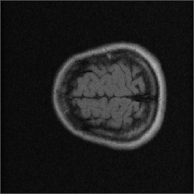

  

[!Open in MATLAB Online](https://matlab.mathworks.com/open/github/v1?repo=mathworks/MRI-Reconstruction-in-MATLAB
# MRI Reconstruction in MATLAB

## Overview

Welcome to the **MRI Reconstruction in MATLAB**&reg;  repository! This project showcases three effective examples of MRI reconstruction algorithms using raw k-space brain image data [1] as input. Each example is designed to leverage GPU capabilities for rapid prototyping and easy deployment in production. Additionally, these examples support CI/CD integration for automated testing and verification, and can be incorporated into an IEC 62304 -compliant medical software development workflow*.

## Features

### 1. IFFT-Based Algorithm

- **Description**: This algorithm uses the Inverse Fast Fourier Transform (IFFT) to reconstruct MRI images from full k-space data, providing a baseline for comparison with more sophisticated methods.

### 2. Wavelet-Based Algorithm (Compressed Sensing)

- **Description**: Utilizing wavelet transforms, this algorithm implements a compressed sensing approach using under-sampled k-space data to enhance image reconstruction speed without compromising the quality.

### 3. Deep Learning-Based Algorithm ([U_Net](https://www.mathworks.com/help/releases/R2025a/vision/ref/unet.html))

• **Description**: Employing a [U_Net](https://www.mathworks.com/help/releases/R2025a/vision/ref/unet.html) architecture, this algorithm uses a deep learning technique with under-sampled k-space data to showcase a modern approach for MRI reconstruction.

## Highlights

### Rapid Prototyping and Deployment
•	GPU-Enabled: Optimized for GPU acceleration for fast prototyping as well as automatic CUDA code generation for deployment.

•	Ease of Use: Designed for straightforward experimentation with easy-to-use apps for visualization and testing.

### Automated Testing and Verification
•	CI/CD Integration: Enabled for use in continuous integration and continuous deployment pipelines for automated testing and verification*.

• IEC 62304 Certification: The algorithms can be incorporated into a IEC 62304 -compliant medical software development workflow*.

*. Requires additional products

## Getting Started

### Prerequisites

You will need MATLAB release R2024b  or newer and the following MathWorks Products to run these examples.

• [Parallel Computing Toolbox](https://www.mathworks.com/products/parallel-computing.html)&trade;

• [MATLAB Coder](https://www.mathworks.com/products/matlab-coder.html)&trade;

• [GPU Coder](https://www.mathworks.com/products/gpu-coder.html)&trade;

• [Medical Imaging Toolbox](https://www.mathworks.com/products/medical-imaging.html)&trade;

• [Deep Learning Toolbox](https://www.mathworks.com/products/deep-learning.html)&trade;

• [Image Processing Toolbox](https://www.mathworks.com/products/image-processing.html)&trade;

• [Wavelet Toolbox](https://www.mathworks.com/products/wavelet.html)&trade;

• [Computer Vision Toolbox](https://www.mathworks.com/products/computer-vision.html)&trade;

### Installation
1. Clone the repository:
`git clone https://github.com/sagar-AI-MW/MRI-Reconstruction-in-MATLAB.git`
2. Navigate to the project directory:`cd MRI-Reconstruction-in-MATLAB`
3. Open MATLAB and add the project directory to the path: `addpath(genpath('path_to_project_directory'))`

### Usage

1. **Run the `startup.m` file first.** It will download the dataset from support files and create the necessary folder structure to run the MRI reconstruction examples.

2. **Navigate to the `MRI_Project/scripts` folder.** There are two folders available for different intentions:

3. **Testing Different MRI Reconstruction Examples:**  Check the folder: **01_Example_Scripts**

   Run the desired algorithm script:

   • `Exp1_IFFT_MRI.mlx` for IFFT-based reconstruction.

   • `Exp2_CS_MRI.mlx` for wavelet-based reconstruction.

   • `Exp3_DL_MRI.mlx` for deep learning-based reconstruction.

4. **Running MRI Reconstruction Examples on GPU and Generating CUDA Code:**
   
   Check the folder: **02_GPU_Support_Scripts**

Run the `demoScript.mlx`, which provides options to run all three examples on GPU or CPU. Furthermore, the script allows to automatically generate CUDA code of all three examples.

### Reference

[1] Lyu, M., Mei, L., Huang, S. et al. M4Raw: A multi-contrast, multi-repetition, multi-channel MRI k-space dataset for low-field MRI research. Sci Data 10, 264 (2023). https://doi.org/10.1038/s41597-023-02181-4

### License
The license is available in license.txt file in this GitHub repository.

Copyright 2025 The MathWorks, Inc.
